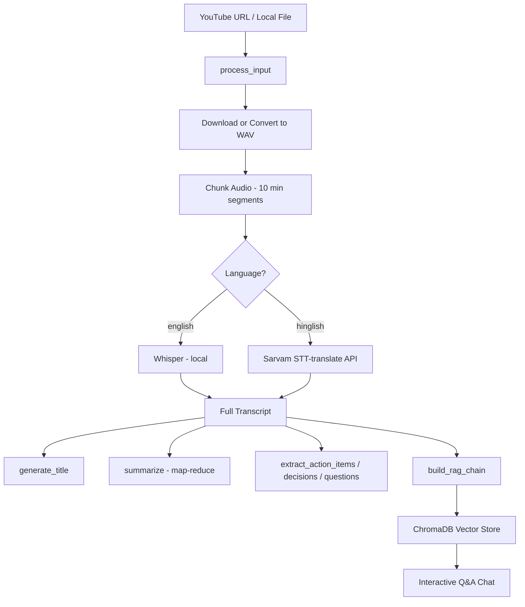

# AI Video Assistant

A **free, local-first meeting and video intelligence tool** inspired by YouTube's "Ask" feature and tools like Fireflies.ai. Paste a YouTube URL or upload a local audio/video file, and the app transcribes it, generates summaries and structured insights, and lets you **chat with the content** using RAG (Retrieval-Augmented Generation).

Built as a portfolio-ready GenAI project using **Python**, **Whisper** (local STT), **Mistral AI** (free-tier LLM), **LangChain LCEL**, **ChromaDB**, and **Streamlit**.

---

## Table of Contents

- [Problem Statement](#problem-statement)
- [Features](#features)
- [Architecture](#architecture)
- [Project Structure](#project-structure)
- [Tech Stack](#tech-stack)
- [Prerequisites](#prerequisites)
- [Installation](#installation)
- [Environment Variables](#environment-variables)
- [Usage](#usage)
- [Pipeline Deep Dive](#pipeline-deep-dive)
- [Module Reference](#module-reference)
- [Design Decisions](#design-decisions)
- [Limitations & Notes](#limitations--notes)
- [Roadmap](#roadmap)
- [Credits](#credits)

---

## Problem Statement

Professionals spend hours in meetings and watching long videos, but most of the value is lost once the session ends:

- Notes are rarely taken consistently
- Action items and decisions get forgotten
- Searching old recordings means rewatching entire videos
- Commercial tools (Fireflies, Otter, etc.) cost **$20–$40/month**

**AI Video Assistant** solves this by turning any meeting recording or YouTube video into a searchable, queryable knowledge base — using mostly **free and local** components.

---

## Features

| Feature | Description |
|---------|-------------|
| **Multi-source input** | YouTube URLs, local MP4/MP3/M4A/WAV files |
| **Local transcription** | OpenAI Whisper runs on your machine (no OpenAI API cost) |
| **Hindi / Hinglish support** | Sarvam AI STT-translate API for Hindi audio → English text |
| **Smart summarization** | Map-reduce summarization via Mistral + LangChain LCEL |
| **Title generation** | Auto-generated professional title from transcript |
| **Action item extraction** | Tasks, owners, and deadlines pulled from transcript |
| **Key decisions** | Important decisions surfaced automatically |
| **Open questions** | Unresolved topics and follow-ups identified |
| **RAG Q&A chat** | Ask natural-language questions grounded in the transcript |
| **Streamlit UI** | Dark-themed web interface with live pipeline status |
| **CLI mode** | Full pipeline + interactive chat from the terminal |

---

## Architecture

The project is split into **two phases**, matching the tutorial workflow:

### Phase 1 — Audio → Text + Intelligence

```
Input (YouTube URL / local file)
        │
        ▼
┌─────────────────────┐
│  Audio Processor    │  yt-dlp download → WAV conversion → 10-min chunks
└─────────┬───────────┘
          ▼
┌─────────────────────┐
│  Transcriber        │  Whisper (English) OR Sarvam (Hinglish)
└─────────┬───────────┘
          ▼
┌─────────────────────┐
│  Summarizer         │  Map-reduce summary + title (Mistral)
└─────────┬───────────┘
          ▼
┌─────────────────────┐
│  Extractor          │  Action items, decisions, questions (Mistral)
└─────────────────────┘
```

### Phase 2 — RAG (Retrieval-Augmented Generation)

```
Full Transcript
        │
        ▼
┌─────────────────────┐
│  Text Splitter      │  500-char chunks, 50-char overlap
└─────────┬───────────┘
          ▼
┌─────────────────────┐
│  Embeddings         │  HuggingFace all-MiniLM-L6-v2 (local)
└─────────┬───────────┘
          ▼
┌─────────────────────┐
│  ChromaDB           │  Persisted vector store (vector_db/)
└─────────┬───────────┘
          ▼
┌─────────────────────┐
│  RAG Engine         │  Similarity search (top-4) → Mistral answer
└─────────────────────┘
```

### End-to-End Flow



---

## Project Structure

```
AI-Video-Assistant/
├── app.py                  # Streamlit web UI (primary interface)
├── main.py                 # CLI entry point + run_pipeline orchestrator
├── test.py                 # Development smoke-test script
├── Requirements.txt        # Python dependencies
├── .env                    # API keys (not committed — see .gitignore)
├── .gitignore
│
├── utils/
│   └── audio_processor.py  # YouTube download, WAV conversion, audio chunking
│
├── core/
│   ├── transcriber.py      # Whisper + Sarvam transcription engines
│   ├── summarizer.py       # Map-reduce summarization + title generation
│   ├── extractor.py        # Action items, decisions, open questions
│   ├── vector_store.py     # ChromaDB build/load + similarity retriever
│   └── rag_engine.py       # LCEL RAG chain + ask_question
│
├── downloades/             # Downloaded / chunked audio files (auto-created)
└── vector_db/              # ChromaDB persistence directory (auto-created)
```

---

## Tech Stack

| Layer | Technology | Cost |
|-------|-----------|------|
| Language | Python 3.10+ | Free |
| YouTube download | `yt-dlp` | Free |
| Audio processing | `pydub` + FFmpeg | Free |
| Speech-to-text (English) | OpenAI Whisper (local) | Free |
| Speech-to-text (Hindi) | Sarvam AI `saaras:v2.5` | Free tier |
| LLM | Mistral `mistral-small-latest` | Free tier |
| Orchestration | LangChain LCEL pipelines | Free |
| Embeddings | HuggingFace `all-MiniLM-L6-v2` | Free, local |
| Vector store | ChromaDB | Free, local |
| UI | Streamlit | Free |

---

## Prerequisites

1. **Python 3.10+**
2. **FFmpeg** installed and available on `PATH` (required by `yt-dlp` and `pydub`)
   - Windows: `winget install FFmpeg` or download from [ffmpeg.org](https://ffmpeg.org)
   - macOS: `brew install ffmpeg`
   - Linux: `sudo apt install ffmpeg`
3. **8 GB+ RAM** recommended for local Whisper (`small` model ~500 MB)
4. **API keys** (free tiers):
   - [Mistral AI Console](https://console.mistral.ai/) → `MISTRAL_API_KEY`
   - [Sarvam AI Developers](https://www.sarvam.ai/) → `SARVAM_API_KEY` (only for Hinglish/Hindi)

---

## Installation

```bash
# Clone the repository
git clone <your-repo-url>
cd AI-Video-Assistant

# Create and activate a virtual environment
python -m venv venv

# Windows
venv\Scripts\activate

# macOS / Linux
source venv/bin/activate

# Install dependencies (uv is faster; pip works too)
pip install -r Requirements.txt
# or: uv pip install -r Requirements.txt
```

Create a `.env` file in the project root:

```env
MISTRAL_API_KEY=your_mistral_api_key_here
SARVAM_API_KEY=your_sarvam_api_key_here
WHISPER_MODEL=small
SARVAM_STT_MODEL=saaras:v2.5
```

> **Note:** `SARVAM_API_KEY` is only required when using the `hinglish` language option.

---

## Environment Variables

| Variable | Required | Default | Description |
|----------|----------|---------|-------------|
| `MISTRAL_API_KEY` | Yes | — | Mistral AI API key for summarization, extraction, and RAG |
| `SARVAM_API_KEY` | For Hinglish | — | Sarvam AI key for Hindi speech-to-text translation |
| `WHISPER_MODEL` | No | `small` | Whisper model size: `tiny`, `base`, `small`, `medium`, `large` |
| `SARVAM_STT_MODEL` | No | `saaras:v2.5` | Sarvam STT model identifier |

**Whisper model trade-offs:**

| Model | Speed | Accuracy | RAM |
|-------|-------|----------|-----|
| `tiny` | Fastest | Lowest | ~1 GB |
| `small` | Balanced | Good | ~2 GB |
| `medium` | Slower | Better | ~5 GB |
| `large` | Slowest | Best | ~10 GB |

---

## Usage

### Streamlit UI (recommended)

```bash
streamlit run app.py
```

1. Open the URL shown in the terminal (usually `http://localhost:8501`)
2. Paste a **YouTube URL** or **local file path** in the sidebar
3. Select language: `english` (Whisper) or `hinglish` (Sarvam)
4. Click **Analyse**
5. View title, summary, action items, decisions, and open questions
6. Use the **Chat** section to ask questions about the transcript

### CLI mode

```bash
python main.py
```

Prompts for a source URL/path and language, runs the full pipeline, prints results, then opens an interactive RAG chat loop. Type `exit` to quit.

### Programmatic usage

```python
from dotenv import load_dotenv
load_dotenv()

from main import run_pipeline
from core.rag_engine import ask_question

result = run_pipeline(
    source="https://www.youtube.com/watch?v=EXAMPLE",
    language="english"
)

print(result["title"])
print(result["summary"])

answer = ask_question(result["rag_chain"], "What were the main topics discussed?")
print(answer)
```

### Development test script

```bash
python test.py
```

Runs audio processing → transcription → summarization → extraction without RAG. Edit the `source` and `language` variables at the top of `test.py` before running.

---

## Pipeline Deep Dive

### 1. Audio Processing (`utils/audio_processor.py`)

| Function | Purpose |
|----------|---------|
| `download_youtube_audio(url)` | Downloads best audio via `yt-dlp`, converts to WAV |
| `convert_to_wav(path)` | Converts any local file to mono 16 kHz WAV (Whisper sweet spot) |
| `chunk_audio(path, minutes=10)` | Splits long audio into manageable segments |
| `process_input(source)` | Auto-detects URL vs local file, returns list of chunk paths |

**Why chunk audio?** Whisper and Sarvam have practical limits on single-request audio length. A 1-hour meeting becomes six 10-minute chunks processed sequentially.

### 2. Transcription (`core/transcriber.py`)

| Function | Purpose |
|----------|---------|
| `load_model()` | Loads Whisper once into memory (cached globally) |
| `transcribe_chunk_whisper(path)` | Local Whisper transcription |
| `transcribe_chunk_sarvam(path)` | Sarvam API — splits into 25s pieces (API 30s limit) |
| `transcribe_all(chunks, language)` | Iterates all chunks, concatenates full transcript |

**Language routing:**
- `english` → Whisper (fully local, no API cost)
- `hinglish` → Sarvam STT-translate (Hindi audio → English text)

### 3. Summarization (`core/summarizer.py`)

Uses a **map-reduce** pattern to handle long transcripts:

1. **Split** transcript into 3000-character chunks (200-char overlap)
2. **Map:** Summarize each chunk individually via Mistral
3. **Reduce:** Combine partial summaries into one bullet-point summary

`generate_title()` sends the first 2000 characters to Mistral and returns an ≤8-word title.

### 4. Extraction (`core/extractor.py`)

Three specialized Mistral chains via a shared `build_chain()` helper:

- **`extract_action_items`** — task, owner, deadline
- **`extract_key_decisions`** — numbered decision list
- **`extract_questions`** — unresolved follow-up questions

> Extraction quality depends on transcript content. A monologue YouTube video may return "No action items found" — that is expected behavior.

### 5. Vector Store (`core/vector_store.py`)

| Function | Purpose |
|----------|---------|
| `get_embeddings()` | HuggingFace `all-MiniLM-L6-v2` on CPU |
| `build_vector_store(transcript)` | Splits text, embeds, persists to ChromaDB |
| `load_vector_store()` | Reloads existing store from disk |
| `get_retriever(store, k=4)` | Top-4 similarity search retriever |

Chunks: **500 characters** with **50-character overlap** (smaller than summarization chunks — optimized for precise retrieval).

### 6. RAG Engine (`core/rag_engine.py`)

| Function | Purpose |
|----------|---------|
| `build_rag_chain(transcript)` | Builds vector store + LCEL chain for new content |
| `load_rag_chain()` | Loads pre-built store for follow-up sessions |
| `ask_question(chain, query)` | Invokes RAG chain with a user question |

**LCEL pipeline:**

```
question → retriever (top-4 chunks) → format_docs → prompt → Mistral → answer
```

The system prompt instructs the model to answer **only** from retrieved context and say *"I could not find this information in the meeting transcript"* when the answer is not present.

---

## Module Reference

### `run_pipeline(source, language)` — `main.py`

Central orchestrator. Returns a dictionary:

```python
{
    "title": str,
    "transcript": str,
    "summary": str,
    "action_items": str,
    "key_decisions": str,
    "open_questions": str,
    "rag_chain": Runnable,  # LangChain LCEL chain
}
```

### Key entry points

| File | Command | Interface |
|------|---------|-----------|
| `app.py` | `streamlit run app.py` | Web UI |
| `main.py` | `python main.py` | CLI + chat |
| `test.py` | `python test.py` | Dev smoke test |

---

## Design Decisions

### Why local Whisper instead of OpenAI Whisper API?
Whisper models are small enough to run on consumer hardware (8 GB RAM). Local inference avoids per-minute API costs and keeps audio data private.

### Why Mistral instead of OpenAI GPT?
Mistral offers a capable **free tier** suitable for summarization and Q&A — keeping the project portfolio-friendly and cost-free.

### Why map-reduce summarization?
A 50-minute meeting can produce 10,000+ words of transcript, exceeding LLM context windows. Map-reduce summarizes in parts, then merges — the same pattern used in production RAG systems.

### Why ChromaDB?
Lightweight, local, persistent vector storage with zero infrastructure. Ideal for a single-user assistant without Redis or Pinecone costs.

### Why Sarvam for Hindi?
Whisper's Hindi accuracy is limited. Sarvam's `saaras:v2.5` model provides better Hindi STT with built-in translation to English — though the free tier limits requests to **≤30 seconds per API call**, requiring 25-second sub-chunking.

### Function-based architecture
Each capability is a small, testable function (`process_input`, `transcribe_all`, `summarize`, etc.) composed by `run_pipeline`. This mirrors production patterns where micro-capabilities are wired together rather than monolithic scripts.

---

## Limitations & Notes

| Item | Detail |
|------|--------|
| **Sarvam 30s limit** | Hindi/Hinglish audio is split into 25-second API calls — long videos generate many requests |
| **No PDF export yet** | `reportlab` and `fpdf2` are in `Requirements.txt` but export is not implemented |
| **YouTube WAV normalization** | `convert_to_wav()` (mono 16 kHz) runs for local files only; YouTube audio relies on `yt-dlp` post-processing |
| **Extraction on monologues** | Action items/decisions work best on meeting-style content, not solo commentary videos |
| **CPU-intensive** | Whisper on CPU can spin up laptop fans — this is normal |
| **Single collection** | ChromaDB uses one `meeting_transcript` collection; each new analysis overwrites the previous store |
| **`load_rag_chain()`** | Intended for reloading a saved store; requires a prior `build_vector_store()` call |

---

## Roadmap

Potential enhancements aligned with the original tutorial vision:

- [ ] PDF / TXT export of summary and transcript
- [ ] Apply `convert_to_wav()` normalization after YouTube downloads
- [ ] Chunk-aware extraction for very long transcripts
- [ ] Multi-session vector store (per-video collections)
- [ ] Deploy to Streamlit Community Cloud
- [ ] Whisper `translate` task for Hindi → English without Sarvam
- [ ] Speaker diarization via Sarvam `with_diarization`

---

## Credits

- **Tutorial:** [Sherians / Akarsh Vyas](https://sherians.com) — AI Video Assistant build series
- **Inspiration:** YouTube "Ask" feature + Fireflies.ai meeting intelligence
- **Models:** OpenAI Whisper, Mistral AI, Sarvam AI, HuggingFace MiniLM
- **Frameworks:** LangChain, ChromaDB, Streamlit

---

## License

This project is intended for educational and portfolio use. Check individual dependency licenses (Whisper, Mistral, Sarvam) for commercial deployment.
